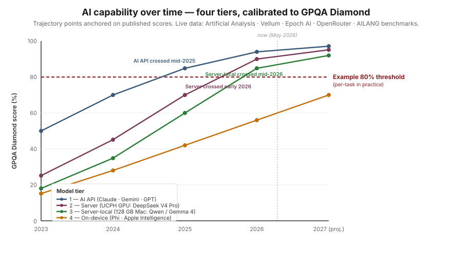

## Purpose

For each task class in the STX physics setting, identify the smallest and cheapest model that performs adequately. The result drives production routing decisions, cost projections, and the migration timeline for self-hosted open-weight models.

**Deliverable.** A versioned eval dataset + runner + a periodically-updated capability-floor report. Reusable beyond M's contract — successors re-run quarterly as new models release.

## The picture

For each task we run, we set a **minimum score threshold** the AI must hit to be useful. We then watch how each model tier — frontier cloud, capable open-weight, small/on-device — tracks against that threshold over time. When a tier crosses the threshold, that's our estimated migration date for routing the task to that tier.

{fig-alt="Four rising curves over 2023–2027 for the four tiers (AI API, server, server-local, on-device) against an 80% horizontal threshold. Vertical drop-lines mark when each tier crosses, with months-of-lag labelled: Tier 1 mid-2025, Tier 2 Q1 2026 (~8 months later), Tier 3 early 2026 (~12 months later), Tier 4 late 2027 (~28 months later)."}

**Catch-up timelines — what waiting buys you.** Each tier reaches today's frontier on a different cadence:

- **Tier 2 (server) lags Tier 1 by ~8 months** on hard reasoning. Efficient MoE architectures (DeepSeek V4) have collapsed the dense-model gap that used to be larger. Wait two release cycles, get a comparable open-weight model.
- **Tier 3 (server-local) lags by ~12 months.** The constraint is what fits on a single workstation; aggressive quantisation and smaller capable architectures (Qwen 3.5 27B at 85.5%, Gemma 4 31B at 84.3%) keep narrowing this. Wait a year, run frontier-equivalent on a 128 GB Mac.
- **Tier 4 (on-device) currently lags by ~24–28 months** on hard reasoning, and the lag is mostly **real hardware constraint, not self-imposed**. The bottleneck is device RAM. The iPhone 15 Pro and iPhone 16 lineup have 8 GB total ([Tom's Guide](https://www.tomsguide.com/phones/iphones/all-iphone-16-models-have-8gb-ram-and-apple-just-explained-why)), and Apple reserves ~4 GB for AI ([The Register](https://www.theregister.com/2024/09/25/apple_4gb_ai/)). That budget supports a ~3 B-parameter model at 2/4-bit quantisation — which is exactly what the [Apple Intelligence on-device foundation model](https://machinelearning.apple.com/research/introducing-apple-foundation-models) uses — but not a 7 B or 14 B model. Analysts argue full on-device LLMs need 20 GB+ ([Wccftech analyst commentary](https://wccftech.com/iphone-16-lineup-to-feature-8gb-ram-insufficient-for-on-device-llm/)). The iPhone 17 Pro is rumoured to ship with 12 GB ([Tom's Guide](https://www.tomsguide.com/phones/iphones/forget-iphone-16-pro-the-iphone-17-pro-just-got-tipped-for-a-big-ram-boost)) — which would open headroom for ~7 B models. There are also research paths (Apple's flash-storage weight streaming) that may shorten the lag without waiting for hardware refreshes. Treat the late-2027 crossing as a working estimate; update as hardware refreshes land.

Three things this plot makes concrete:

- **Some tasks always want state-of-the-art** — high thresholds (complex multi-step physics reasoning, nuanced pedagogical scaffolding) may stay on the cloud frontier indefinitely.
- **Other tasks have lower thresholds** — summarisation, formatting, structured extraction, simple Q&A. For these, open-weight catches up in months, and on-device follows a year or two behind.
- **The timeline is estimable.** We're not guessing when to migrate — we're tracking published benchmark trajectories and projecting against our task-specific thresholds. The projection sharpens every time a new model releases.

## Public benchmarks we draw on

The eval doesn't recreate the wheel — it composes published benchmarks with STX-physics-specific task data. Primary sources for the model panel and trajectory estimation:

| Benchmark | What it measures | Relevance |
|---|---|---|
| [GPQA](https://github.com/idavidrein/gpqa) | Graduate-level physics, chemistry, biology questions | Direct upper-bound proxy for stx physics reasoning |
| [MATH](https://github.com/hendrycks/math) | Competition-level mathematics | Closely tracks formula-and-derivation tasks |
| [MMLU](https://github.com/hendrycks/test) | Massive multitask language understanding | Broad knowledge ceiling |
| [MMMU](https://mmmu-benchmark.github.io) | College-level multimodal understanding (figures, diagrams) | Tracks the multimodal-input path |
| [HumanEval](https://github.com/openai/human-eval) / [MBPP](https://github.com/google-research/google-research/tree/master/mbpp) | Code generation | Relevant for the code-execution MCP tool |
| [Open LLM Leaderboard](https://huggingface.co/open-llm-leaderboard) (HuggingFace) | Aggregated open-weight comparisons | Live tracker for tier 3 candidates |
| [Artificial Analysis](https://artificialanalysis.ai) | Cross-provider model comparisons (price, speed, quality) | Live tracker for tier 1 and tier 2 |
| [Epoch AI](https://epochai.org) | Long-run AI capability trends | Source for the trajectory projections |
| **AILANG benchmarks** | Project-internal panel runs across multiple providers | Primary source for AIPLA's per-task scores |

External benchmarks calibrate the model panel; the AIPLA eval adds physics-specific task definitions and the threshold scores.

### Real numbers — GPQA Diamond, the closest public proxy

GPQA Diamond is graduate-level physics, chemistry, and biology — the closest public benchmark to upper-secondary physics reasoning, and harder than most STX physics tasks will require. Scores below are **re-verified against primary sources (2026-07-15)** after an audit found several earlier blog-sourced figures to be unreliable or fabricated (see notes ¹ ²):

| Tier | Model | Hardware needed | GPQA Diamond | Source |
|---|---|---|---|---|
| 1 — AI API | Claude Opus 4.8 | None (API) | **93.6%** | [Anthropic system card](https://www-cdn.anthropic.com/0b4915911bb0d19eca5b5ee635c80fef830a37ea.pdf) |
| 1 — AI API | Claude Opus 4.7 | None (API; Anthropic / Bedrock / Vertex) | **94.2%** | [Anthropic](https://www.anthropic.com/news/claude-opus-4-7) |
| 1 — AI API | Gemini 3.1 Pro Preview | None (Vertex AI, EU regions) | **94.1–94.3%** | [Model card](https://deepmind.google/models/model-cards/gemini-3-1-pro/) · [Artificial Analysis](https://artificialanalysis.ai/evaluations/gpqa-diamond) |
| 1 — AI API | GPT-5.5 (xhigh) | None (OpenAI / Azure) | **93.5%** | Artificial Analysis |
| 1 — AI API | Gemini 2.5 Pro | None (Vertex AI EU — prototype default) | **84.0%** preview · **86.4%** GA | [Google model card](https://storage.googleapis.com/deepmind-media/Model-Cards/Gemini-2-5-Pro-Model-Card.pdf) · Epoch AI |
| 2 — Self-hosted server | Qwen3-Next-80B-A3B (80B MoE / 3B active) | Multi-GPU node (~2× A100 80 GB) | **72.9%** | [Qwen HF card](https://huggingface.co/Qwen/Qwen3-Next-80B-A3B-Instruct) |
| 2 — Self-hosted server | DeepSeek V4 (Pro / Flash MoE) | Cluster | **no published GPQA** ¹ | — |
| 3 — Server-local | Qwen3.5-27B | ~30 GB — single GPU / 128 GB Mac | 85.5% ² *(vendor, unverified)* | [Qwen card](https://huggingface.co/Qwen/Qwen3.5-27B) |
| 3 — Server-local | Gemma 4 31B | ~32 GB — single GPU | 84.3% ² *(vendor, unverified)* | [DeepMind Gemma 4](https://deepmind.google/models/gemma/gemma-4/) |
| 3 — Server-local | Qwen3-32B *(prior gen, verified)* | ~32 GB | **68.4%** | [Qwen3 tech report](https://arxiv.org/abs/2505.09388) |
| 3 — Server-local | Gemma-3-27B *(prior gen, verified)* | ~27 GB | **42.4%** | [Gemma 3 report](https://arxiv.org/abs/2503.19786) |
| 3 — Server-local | Phi-4 (14B) | ~14 GB — single consumer GPU | **56.1%** | [Phi-4 tech report](https://arxiv.org/abs/2412.08905) |
| 4 — On-device | Apple Intelligence · Gemini Nano (~3B) | phone / tablet / Apple Silicon | n/a (not GPQA-benchmarked) | Apple · Google |

¹ DeepSeek V4's official technical report (arXiv:2606.19348) publishes **no GPQA-Diamond score**; the widely-cited "90.1% Pro / 79.0% Flash" figures are blog-only and mutually inconsistent (Flash appears as 79.0 / 88.1 / 71.2 across sources) — removed as unverifiable.
² Qwen3.5-27B (85.5) and Gemma 4 31B (84.3%) appear on vendor pages but are **self-reported, reasoning-mode, no-tools** figures with no independent confirmation, and imply extraordinary generational jumps (+17 / +42 points over the prior gen's *verified* 68.4 / 42.4). Treat as unconfirmed upper bounds; the verified prior-gen rows are the safer floor. **This uncertainty is exactly why AIPLA runs its own eval** (below) — on real STX task data these self-hostable models land ~52–80%, not near-frontier.

GPQA Diamond is a *graduate-level* science benchmark — Tier 4 models aren't designed for that level of reasoning, which is why they don't have published scores on it. They serve light text tasks (summarisation, formatting, short Q&A), which is what gets routed to them in practice.

**What this means for the [UCPH self-host migration](self-hosting.qmd).** *"Cloud now, on-prem someday"* is too conservative — read by the capability a task needs:

1. **Moderate thresholds (~70 %) → Tier 3 (server-local) is viable today — but the "near-frontier at 84–86 %" claim does not survive audit.** The *independently-verified* self-hostable ceiling is ~68 % (Qwen3-32B GPQA); the 84–86 % figures for Qwen3.5-27B / Gemma 4 31B are unconfirmed vendor self-reports (note ²). On AIPLA's own STX task these single-GPU models land **52–80 %** (below). Tier 3 clears moderate task thresholds comfortably on a 128 GB Mac or a single A100; it is **not yet a substitute for the cloud frontier** on the hardest reasoning.
2. **Tier 2 (UCPH GPU cluster) is *emerging*, not settled.** DeepSeek V4 has no published GPQA, so the earlier "90.1 % → within 4 points of frontier" claim is **withdrawn**. The verified Tier-2 anchor is Qwen3-Next-80B-A3B at 72.9 % GPQA (~80 % on STX) — genuinely strong, fully on-prem, **no data leaving the building** — but a clear step below the cloud frontier.
3. **93%+ → Tier 1 (cloud API) is still the answer in 2026**, but the gap narrows every release cycle.
4. **Light tasks → Tier 4 (on-device) is already operational.** It trails at 40–56% on graduate science and isn't designed for it; summarisation, formatting, and short Q&A are what get routed there.

**Where this populates from going forward.** AIPLA's own capability-floor report (a periodic deliverable, refreshed as new models release) will include current scores across the full model panel for *each* AIPLA task class — not just GPQA Diamond, which is a proxy. The eval composes published benchmark trajectories with AIPLA's STX-physics-specific task definitions.

### Live trackers (verify current scores here)

- **[Artificial Analysis](https://artificialanalysis.ai)** — cross-provider model comparisons (price, speed, quality, latency); live and updates frequently
- **[Open LLM Leaderboard](https://huggingface.co/spaces/open-llm-leaderboard/open_llm_leaderboard) (HuggingFace)** — comprehensive open-weight tracker
- **[LMArena](https://lmarena.ai)** — human-preference comparisons; useful for chat-style tasks
- **[Epoch AI Benchmarking Dashboard](https://epoch.ai/data/ai-benchmarking-dashboard)** — long-run trajectories and projections
- **[GPQA leaderboard](https://github.com/idavidrein/gpqa)** — primary source for GPQA Diamond results

## First AIPLA correctness run — STX Fysik A (provisional, July 2026)

This is the first run of AIPLA's own capability-floor eval — the task-specific numbers this page has promised, standing in for the GPQA proxy on one concrete task class. **Provisional and unverified** (see limitations below): directional signal, not a leaderboard.

**What it measures.** The *Correctness* dimension of task class **T1** (exam problem solving): can a model solve a Danish stx Fysik A written-exam subquestion, graded against the official ministry answer key? Metric = **solve accuracy** = correct ÷ (correct + incorrect) over the *text-solvable* subset (33 subquestions from the 2023–24 gold sets), with a separate **abstention rate** — items the model declines because they need a graph/figure it cannot see. Models answer via a schema-enforced `{value, unit}` with an explicit "I don't know" option, so a text-only model *abstains* on figure-dependent items rather than guessing; grading is deterministic value/unit compare plus an LLM judge against the key.

Results are **means ± std over 5 runs** per model (frontier ×3; all runs n = 33, verified error-free), against the page's **≥ 80% capability-floor threshold**. Tiers match the [GPQA table above](#real-numbers--gpqa-diamond-the-closest-public-proxy):

| Model | Runs on | STX (mean ± std) | ≥ 80% |
|---|---|---|---|
| Claude sonnet / opus / haiku | Cloud API (Tier 1) | 93–96% (± ≤ 2) | ✓ |
| gemini-3.5-flash (app top) | Cloud API — Vertex (Tier 1) | 95 ± 2 | ✓ |
| **deepseek-v4-flash** (open MoE) | Server / cluster — multi-GPU (Tier 2) | **91 ± 2** | ✓ |
| qwen3-32b (open) | Single GPU — ~1× A100 80 GB (Tier 3) | 88 ± 6 | ✓ |
| gemini-2.5-flash (app mid) | Cloud API — Vertex (Tier 1) | 87 ± 3 | ✓ |
| **qwen3-8b** (open, 8 B) | **Small local — single 24 GB GPU / laptop (Tier 3)** | **83 ± 3** | ✓ (borderline) |
| qwen3-next-80b-a3b (open MoE) | Server / cluster — multi-GPU (Tier 2) | 75 ± 6 | ✗ |
| gemini-2.5-flash-lite (app lite) | Cloud API — Vertex (Tier 1) | 73 ± 4 | ✗ |
| qwen3-30b-a3b (open MoE) | Single GPU (Tier 3) | 68 ± 9 | ✗ |
| mistral-small-24b (open) | Single GPU (Tier 3) | 67 ± 6 | ✗ |
| gemma-3-27b (open) | Single GPU (Tier 3) | 64 ± 3 | ✗ |

**Why the numbers moved from the first single-run snapshot — and why that *is* the finding.** An earlier version of this table used *single* n = 33 runs. Repeating each model 5× reshuffled the mid-field substantially: qwen3-32b 73 → **88**, deepseek-v4-flash 86 → **91**, qwen3-8b 88 → **83**, qwen3-next-80b 80 → 75, gemini-lite 66 → **73**. **Single runs are not trustworthy at this resolution** — the model's sampling *and* the LLM judge are both stochastic, and at n = 33 a few flipped items = several points. **Open-weights are markedly noisier (std 3–9) than the cloud models (std 2–4)**, so their single-run numbers are the least reliable of all.

**Cost shape** (detailed in [self-hosting](self-hosting.qmd)): Tier 1 is **pay-per-token** — cheap for the flash/lite tiers, materially more for the frontier (opus-class ~2 orders of magnitude above flash-class per token). Tiers 2–3 are **amortised hardware, no per-call cost, data stays on-prem** — a one-time GPU rather than a running bill. The ≥ 80% floor is *reachable at Tier 3 today*: `qwen3-8b` averages 83 ± 3 on a single consumer GPU (borderline but the cheapest self-host), and `deepseek-v4-flash` sits at a stable 91 ± 2 on a multi-GPU node — the sharpest form of "self-hosting is viable now for this task."

**Three reads that survive the variance:**

1. **The frontier is saturated and stable** — Claude + gemini-3.5-flash at 93–96 with std ≤ 2. Well-posed stx numeric physics is *not* frontier-hard, which reframes "always want state-of-the-art" for this task class.
2. **The app's own tiers genuinely descend:** gemini 3.5-flash **95** → 2.5-flash **87 ± 3** → 2.5-flash-lite **73 ± 4**. The flash → lite gap is a real ~14 points (the distributions separate) — though the lite tier's *earlier published* "66% / misses 1-in-3" was a low-outlier draw; its true mean is ~73. **2.5-flash is the app's sweet spot** for this class.
3. **Self-hosting is viable — but the *specific* model matters.** `deepseek-v4-flash` (91 ± 2, multi-GPU) is near-frontier and stable; `qwen3-8b` (83 ± 3) clears ~80 on a single consumer GPU but sits close to the line. The mid-size single-GPU dense models (mistral-24b 67, gemma-27b 64, qwen3-30b 68) do **not** clear the floor, and their ± 5–9 leaves them mutually indistinguishable. So "self-host is viable now for T1" holds — but the earlier "any 27–31B is near-frontier" story (which traced to the fabricated GPQA numbers) does not.

**Calibration — the abstention signal.** The stronger models abstain honestly (5–8 items) on the figure-dependent problems rather than inventing a reading. For a tutoring app, where a confidently-wrong answer is the real failure mode, *knowing what it can't do* is a distinct and valuable axis — one this eval measures directly.

**Validity.** *Internal:* the calibration gate (top tier ≥ ~95% on the official keys) passes, so the top tier's answers are provisionally trustworthy as keys. *External:* across the open-weights, STX (5-run means) correlates with re-verified published GPQA-Diamond at **Pearson r ≈ 0.73** (n = 7) — genuine external validity; the eval tracks the same underlying capability as an established benchmark. But it does **not** substitute for measurement: **`qwen3-8b` is a stark outlier** — the *lowest* GPQA of the open models (63.3) yet an 83% STX mean, because GPQA is graduate-level while STX is upper-secondary. STX sits well above GPQA (the task is easier), and the gap is widest for small models. So a GPQA-based shortlist would have mis-ranked the cheap self-host candidates. Correlated enough to trust the method; divergent — and, as the variance shows, noisy — enough that the task-specific run, *repeated*, is necessary. *(n = 7; `deepseek-v4-flash` uses DeepSeek-V3.2 GPQA as proxy; thinking/non-thinking mode confounds some published figures — treat r as directional.)*

**Limitations — read before citing.**

- **Provisional.** 5 runs per model (frontier 3), **n = 33 items** each. The 5-run means are far more stable than the single-run snapshot this replaced, but the item set is still small — treat gaps under ~1 std (esp. within the open-weights, ± 5–9) as unresolved, and read bands, not exact ranks.
- **Judge-graded**, not yet human-audited. The methodology's human-calibration sample (~20 items graded by AR or a physics teacher) is the next step, and would also pin the judge's own contribution to the variance.
- **Figure / graph items** are no longer fully excluded — they are scored on a *separate* vision axis below, not in the 33-item text metric. The figure-to-problem mapping still needs expert (AR / JB) review.
- The two genuine frontier failures (a shared physical-inference gap; an r₀/rₙ interpretation) are real signal, not grading errors.

*Snapshot 2026-07-15 (means over 5 runs). Numbers will firm up as the item set grows and the judge is human-calibrated.*

### Graph-reading (vision) — the previously-excluded items, now scored

The figure-dependent items above were excluded because a text-only model cannot see the graph. AILANG's runtime gained **image input** (`std/ai` v0.30.0), so the harness now attaches the problem's figure(s) and lets a **vision-capable** model read them directly. This is a **separate, smaller axis** — the 8 held graph-reading subquestions, scored only on models that accept images (Claude is absent: the account is usage-capped until 1 Aug). Same grader as the text panel at the wider graph-reading tolerance (0.10); the figure is sent as an image with the answer schema demanded in the prompt. It includes the current open **vision-language (VL)** models — the dedicated multimodal counterparts to the text panel's open models.

| Model | Runs on | Graph-reading (mean ± std, 5 × 8) |
|---|---|---|
| gemini-3.5-flash (app top) | Cloud (Tier 1) | 98 ± 5 |
| **qwen3-vl-235b-a22b** (open VL) | Server / cluster — multi-GPU (Tier 2) | **95 ± 6** |
| gemini-2.5-flash (app mid) | Cloud (Tier 1) | 93 ± 6 |
| **qwen3-vl-32b** (open VL) | Single GPU (Tier 3) | **88 ± 0** |
| **glm-4.6v** (open VL) | Single GPU (Tier 3) | **83 ± 6** |
| gpt-5-mini | Cloud (Tier 1) | 75 ± 0 |
| glm-5v-turbo (open VL) | Single GPU (Tier 3) | 70 ± 6 |
| qwen3-vl-8b (open VL) | Small local — laptop (Tier 3) | 63 ± 8 |
| gemma-3-27b (open, general) | Single GPU (Tier 3) | 60 ± 18 |
| mistral-small-3.2-24b (open, general) | Single GPU (Tier 3) | 43 ± 10 |
| gemini-2.5-flash-lite (app lite) | Cloud (Tier 1) | 40 ± 9 |

**What it shows.** *Vision turns abstentions into scores* — items that were pure "I can't see it" abstentions on the text panel are now solved, and the frontier clears them cleanly (gemini-3.5-flash **98 ± 5**). The sharper finding is on self-hosting: **a *dedicated* open VL model closes the figure-reading gap that general open-weights cannot.** `qwen3-vl-235b` (**95 ± 6**, multi-GPU) sits second only to the frontier; `qwen3-vl-32b` clears the ≥ 80% floor at **88 ± 0** (zero variance) on a *single* GPU — where the general open models flounder (gemma-3-27b 60 ± 18 with hard errors, mistral-small-3.2 43). So the earlier "self-host is blind to figures" caveat was really "*general* open-weights are" — the fix is to run a VL model (Qwen3-VL / GLM-4.6V class), not a text model, on the image items.

**Read the bands, not the ranks — more so than above.** At **n = 8** one item is ± 12.5 pts, so even over 5 runs the groups blur; the clean separations are frontier + qwen3-vl-235b (~93–98) at the top and mistral / gemini-lite (~40) at the floor, with a broad middle. Two oddities survive the noise: `qwen3-vl-32b` and `gpt-5-mini` are *zero*-variance (identical every run), while `gemma-3-27b` swings ± 18. This is a **proof the capability is now measurable**, not a precise leaderboard. And the "one model for both" question is now settled: the VL models were also run on the *text* panel and solve it **12–36 points worse** than the dedicated text model at each tier (all below the 80% floor) — so **no single open model does both**, and self-host runs a text model *plus* a VL model per tier, routed by whether the item has a figure (see [self-hosting](self-hosting.qmd)). Remaining open items: growing the graph set and an expert check of the figure-to-problem mapping (AR / JB).

*Snapshot 2026-07-16 (means over 5 runs, n = 8 vision items). Provisional; a separate axis from the 33-item text metric.*

## Task taxonomy

Anchored on the four AIPLA research questions, refined with AR's curriculum priorities (experiments, mathematical representations, written assessment).

| ID | Task class | Mapped RQ | Source of examples |
|---|---|---|---|
| T1 | Problem-set hints (mechanics, electromagnetism, etc.) | RQ1 (exam problem sets) | STX exam past papers; AR's curriculum annotations |
| T2 | Experimental troubleshooting | RQ2 (experiments) | Lab guides; teacher input |
| T3 | Conceptual exploration / Socratic dialogue | RQ3 (conceptual) | Curriculum core-material topics |
| T4 | Presentation critique | RQ4 (presentations) | Anonymised student slide decks (when available) |
| T5 | Worksheet OCR / diagram interpretation | cross-cuts RQ1–2 | Photos of free-body diagrams, hand-drawn graphs |
| T6 | Tabular / sensor data interpretation | RQ2 | CSV exports, Tracker outputs |
| T7 | LaTeX / formula generation | cross-cuts | Embedded in T1, T3 |

Each task class needs ~20–50 graded items to be statistically meaningful. Initial scale: 10–20 per class for v0.1, expand iteratively.

## Capability dimensions

| Dimension | Why it matters | Measurement |
|---|---|---|
| Correctness | Did the model give the right physics answer? | Deterministic where possible (exam answer keys); LLM-as-judge otherwise |
| Pedagogical appropriateness | Did it hint rather than solve? | LLM-as-judge against ESRU / IBSE rubric |
| Multimodal accuracy | Did it correctly read the diagram/photo? | Human-graded sample + LLM-as-judge |
| LaTeX validity | Are formulae renderable and correct? | Parse + render check |
| Latency | Acceptable for classroom UX? | p50/p95 ms |
| Cost | €/1000 tasks | Per-provider rate card |

## Model panel

The full panel of models tracked is the four-tier table above. The eval composes published benchmark trajectories (GPQA, MMLU, MMMU, MATH, AILANG's own runs) with AIPLA's STX-physics-specific task definitions. Panel updates as new models release.

## KPIs

Per task class, tracked over time:

- **Capability floor** — smallest/cheapest model achieving ≥ 80% on the task class. *This is the headline metric.*
- **Cost ratio** — €/1000 tasks at floor vs. €/1000 at frontier
- **Latency at floor** — p95 ms
- **Local-readiness fraction** — % of task classes where an open-weight model sits at the floor. When this approaches 100%, full local deployment becomes viable.

## Scoring methodology

- **Deterministic where possible** — exam problems with answer keys, structured extractions, LaTeX renders.
- **LLM-as-judge with rubric** for qualitative dimensions (pedagogical appropriateness, conceptual depth). Judge model = Claude 4.7 or equivalent frontier; rubric versioned alongside the eval.
- **Human-rated calibration sample** — ~20 items per task class graded by AR or a physics teacher, used to calibrate the LLM judge.

## Versioning and reproducibility

- Eval set lives under `infrastructure/evals/tasks/` with version tags (v0.1, v0.2, ...)
- Runner is deterministic given a fixed model panel and dataset version
- Results snapshots dated and never overwritten
- Every capability-floor report revision cites the dataset and snapshot versions it draws on

## How this connects

The [Architecture](architecture.qmd) model router reads the capability-floor matrix to choose models per task class. The local-readiness fraction signals to UCPH IT when on-prem [self-hosting](self-hosting.qmd) is worth the GPU investment. New model classes from the [Strand C](strands.qmd#c1-beyond-llms) investigation plug into the same eval to be compared against the LLM baselines. The eval itself is a research instrument that outlives the contract.

---

## Session analytics — pedagogical rubrics (v1.1+ direction)

The capability-floor eval covers *model quality*. A separate question is what to do with the raw session data AIPLA accumulates once pilots are running: every chat turn, workbench state write, and progress tick is already in BigQuery. The gap between that raw activity stream and *pedagogically meaningful signal* for teachers is where a rubric framework lives.

Two frameworks from the physics-education-research literature fit AIPLA's data shape and are under consideration for v1.1+. **Framework choice sits with JB and AR** — engineering implements once the framework is picked and the BigQuery sink (sprint 1.2) is live.

### ICAP (Chi & Wylie 2014) — engagement quality

Labels each student utterance/action with a cognitive engagement mode:

| Mode | Typical AIPLA signal |
|------|---------------------|
| **Passive** — receives without processing | Long pauses; one-word acknowledgements after a tutor message |
| **Active** — manipulates given information | Slider drag, sim launch, pressing "launch" button |
| **Constructive** — produces something new | Student turn with causal language ("I think…", "because…", "fordi…") |
| **Interactive** — builds on the tutor's reasoning | Question that extends the tutor's previous question; "but what if…" |

Output: a per-session engagement histogram (e.g., "28% passive, 41% active, 22% constructive, 9% interactive"). Each mode maps to existing AIPLA data; no new instrumentation needed — detection runs as a post-session LLM-labelling pass over the BigQuery log. An ACL 2025 paper validated this approach on GenAI tutor conversations specifically.

A session with mostly Passive + Active engagement and low Constructive/Interactive is a signal for the teacher to adjust scaffolding — not a mark of poor tutor performance.

### FCI misconception taxonomy (Hestenes et al.) — concept tracking

The Force Concept Inventory defines ~30 labelled Newtonian misconceptions, each with recognisable linguistic signatures. Applied to AIPLA's Boldkast and KineBot sessions, it lets the teacher analytics chat say something specific rather than generic:

| Misconception | Linguistic signature in chat | Relevant activity |
|---|---|---|
| `velocity-proportional-to-force` | "if I push harder it goes faster for longer" | Boldkast, KineBot |
| `motion-implies-active-force` | "what's pushing it now?" during free-flight | Boldkast |
| `vector-composition-nonvectorial` | "the horizontal and vertical cancel each other" | Boldkast — the key appresent DRA for vx/vy independence |
| `gravitational-mass-dependence` | "heavier falls faster" | Boldkast |
| `position-velocity-undiscriminated` | treats x(t) and v(t) graphs as the same | KineBot graph plotter |

FCI labelling is a per-turn classification against a finite misconception list — tractable as a lightweight LLM call. Note: FCI is Newtonian-mechanics-specific; LED Planck and future quantum/waves activities need a different taxonomy (no FCI equivalent exists for those domains yet — AR's input needed).

### Minimum viable starting point

A combined ICAP + FCI pass on Boldkast sessions, run post-session, with results surfaced in the teacher analytics chat as:

> *"Group bold-kazoo-87: 38% constructive engagement — above class average. Two FCI misconception signals detected: `motion-implies-active-force` (turns 12, 17) and `vector-composition-nonvectorial` (turn 23). The tutor addressed the second but not the first."*

This requires: BigQuery sink live (1.2), per-activity DRA map authored by AR + JB, and a labelling-pass design review with JB. Not before mid-point review.
