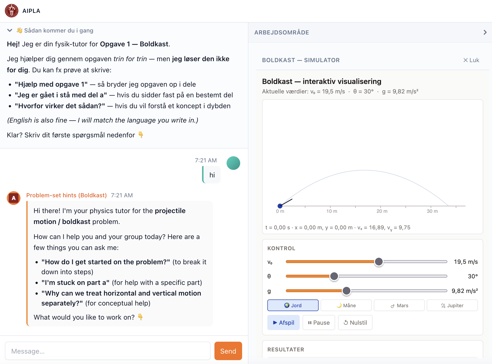

These are real artefacts produced by a project teacher using GenAI (ChatGPT, Claude) on their own — before AIPLA's infrastructure exists. They are the form factor AIPLA's [Strand A](strands.qmd#strand-a-pedagogical-bot-infrastructure) is designed to make safe, configurable, and reusable at class scale.

::: {.callout-tip appearance="simple"}
**v0.1 live now.** The first deployed AIPLA chat is at **[aipla-v01-frontend-wgwhd7mspa-lz.a.run.app/group](https://aipla-v01-frontend-wgwhd7mspa-lz.a.run.app/group)**. Anonymous group-ID join, `problem-set-hints` Danish physics-tutor skill (`Boldkast` projectile-motion problem) paired with an embedded **interactive simulator on the workbench**, KU coat-of-arms branding, KaTeX-rendered formulae, inline AI-generated SVG diagrams. Built 2026-05-19 through 2026-05-21.
:::

## v0.1 in production — what students see

The deployed app went through a substantial UX iteration on 2026-05-21: the chat tutor is now paired with an interactive **workbench surface** on the right showing the problem statement, an embedded simulator, and a 4-step self-assessment checklist. The tutor can read the student's workbench state — slider values, which steps they've checked off — and respond accordingly. This is the [multi-surface architecture from ADR-015](architecture.qmd#adr-015-unified-multi-surface-ui-ai-directs-the-layout) in actual production, not just in the design doc.

::: {.column-screen-inset layout-ncol=2}
{fig-alt="Screenshot of the AIPLA v0.1 deployed app showing chat on left with an AI-generated projectile-motion SVG diagram, and workbench on right with the Boldkast problem statement and a Fremgang progress checklist"}

{fig-alt="Screenshot of the AIPLA v0.1 app showing the projectile simulator running on the workbench surface with sliders and gravity presets"}
:::

**Mobile form factor — same architecture, tab-collapsed below ~600px:**

{fig-alt="Mobile screenshot of the AIPLA v0.1 app showing the Chat/Arbejde tab pattern, three human tool-use cards narrating workbench actions (slider adjustments and gravity preset change), the student asking 'can you see the values I set?', and the tutor responding with the exact values and a Socratic prompt about lower gravity"}

**What this third screenshot demonstrates:**

- **Mobile tab pattern** — `Chat | Arbejde` tabs below the `md` breakpoint. Matters because the brief specifies *"one shared phone per three students"* — the deployed app degrades to phone form factor without losing the multi-surface architecture.
- **Human tool-use cards** — when a student moves a slider or changes a preset on the workbench, a card appears inline in the chat ("Adjusted v₀ to 17.5 m/s ✓"). The workbench *narrates its state into the conversation* rather than being a silent sidebar. Architecturally these are first-class conversation primitives — a new artefact type beyond text + SVG + MCP-App-panel.
- **End-to-end bidirectional loop in action** — student sets values on sim → cards appear in chat → student asks *"can you see the values I set?"* → tutor confirms exact values *and* uses them as the substance of the next inquiry prompt. This is the multi-surface architecture from [ADR-015](architecture.qmd#adr-015-unified-multi-surface-ui-ai-directs-the-layout) doing real pedagogical work, not just rendering side-by-side.

**What's visible across the three screenshots:**

- **Chat surface (`chat`):** Danish problem-set-hints tutor, Socratic scaffolding, AI-generated inline SVG diagrams, **human tool-use cards narrating sim actions**
- **Workbench surface (`workbench`):** problem statement, interactive Boldkast simulator (sliders for v₀ θ g, gravity presets, trajectory plot, results), self-assessment checklist
- **Bidirectional state flow:** tutor reads simulator values + student's checked steps + recent slider moves, references them in its responses
- **Group-ID join:** anonymous, no PII (ADR-001); 30-day TTL friendly codes (`bold-kazoo-87`, `ruby-petal-72` etc.); teachers hand codes out
- **Responsive across form factors:** desktop 50/50 split (screenshots 1–2) collapses to chat/workbench tabs on phone (screenshot 3)

**What's deliberately limited in v0.1:**

- One hard-coded exercise (Boldkast). v1 ships with 3–5 teacher-prepared exercises and student-picks-at-join.
- One model in active routing (Gemini 3.5 Flash). Capability-floor eval refinements come post-Jutland.
- No teacher-authoring UI yet. Teachers will use the same app surface to author and monitor — same skills framework, different role-filtered skill set.

::: {.callout-note appearance="simple"}
**The canonical workflow** (as the teacher who produced these artefacts described it):

> *Teacher's prompts to build simulation → simulation created → teacher validates the simulation → embedded chatbot created (referencing the simulation's specific UI).*

Sim and tutor are designed together as a **paired unit**, not two separate things. The tutor's system prompt names specific visual elements of its paired simulation ("the blue arrow", "the vx graph") — the tutor *is* the simulation's pedagogical scaffold, not a generic physics chatbot. AIPLA's architecture codifies this pairing.
:::

## A self-contained interactive simulation

This is a 1375-line standalone HTML / CSS / JS simulation of projectile motion — no external dependencies, no API keys, no build step. It was generated by GenAI from a single prompt. Try the sliders, launch the ball, watch the live graphs.

::: {.callout-note appearance="simple"}
The simulation is **embedded in a sandboxed iframe** with `sandbox="allow-scripts"` only — exactly the pattern AIPLA will use for student-facing artefacts. See [ADR-013](architecture.qmd#adr-013-artefact-safety-content-review-pipeline) for the full content-review pipeline.

This is the *richer* of two simulations the teacher generated. They prefer the *simpler* version paired with a chatbot (described below) — that's the canonical AIPLA pattern. We show this richer one here because it works fully without an API key, which the simpler-with-chatbot version doesn't.
:::

<iframe src="assets/examples/projectile-motion.html"
        sandbox="allow-scripts"
        style="width:100%; height:1500px; border:1px solid #ddd; border-radius:8px; background:#f0f4f8;"
        title="Projectile Motion — interactive simulation generated by GenAI">
</iframe>

[Open the simulation in a new tab](assets/examples/projectile-motion.html){target="_blank" rel="noopener"} if the embed feels cramped on a smaller screen.

**What AIPLA adds to this pattern:**

- Teachers don't need to generate a fresh sim themselves — a `physics-sim-builder` skill generates and previews one in chat ([Strands page](strands.qmd#teacher-facing-primary))
- Generated HTML passes through a server-side review pipeline ([ADR-013](architecture.qmd#adr-013-artefact-safety-content-review-pipeline)) before students see it
- Sims live in a vetted GitHub library — approved once, reused across classes
- All AI traffic routes through the project's central keys ([ADR-014](architecture.qmd#adr-014-per-group-per-class-budget-enforcement)) — no per-student API keys, no surprise bills

## The paired Socratic-tutor system prompt

The system prompt below was **built specifically for the simpler paired-chatbot simulation** (not the richer one embedded above) — designed alongside that simulation as a single unit. It is the **canonical AIPLA pattern**: the tutor's instructions name specific visual elements of its paired sim, so students know exactly what to look at when the tutor asks *"what do you notice about the blue arrow?"*

Strict Socratic constraints, three teaching phases, hidden concepts that should be discovered rather than stated, polite redirects for off-topic requests. This is the kind of skill configuration teachers will produce in AIPLA via the `problem-set-helper-config` and `concept-dialogue-config` skills, with structured A2UI forms rather than raw prompt text — and the tutor's prompt is **co-generated** with the simulation it pairs with, referencing its specific UI.

**One technical note on the original paired-chatbot file:** that version requires a user-provided Anthropic API key entered in the browser, calling Anthropic directly. AIPLA replaces this with **server-side central key management** ([ADR-014](architecture.qmd#adr-014-per-group-per-class-budget-enforcement)) — same paired-tutor pattern, different key handling. Teachers and students never see an API key.

```text
You are a warm, encouraging, and gently playful physics tutor helping
high school students learn about Projectile Motion through an interactive
simulation they are using right now on the same page.

YOUR TEACHING PHILOSOPHY — STRICTLY SOCRATIC:
You NEVER give direct answers or reveal the correct conclusion.
Instead, you ask thoughtful questions, invite predictions, encourage
the student to try something in the simulation, or reflect on what
they just observed. Your goal is to guide students to discover
concepts themselves through their own thinking and experimenting.

YOUR PERSONALITY:
- Patient, curious, supportive, occasionally funny and light-hearted
- You celebrate effort and curiosity, not just correct answers
- Use simple language suitable for teenagers
- Keep responses concise — 2 to 4 short paragraphs maximum
- Never be lecture-like, preachy, or long-winded

YOUR THREE TEACHING PHASES — adapt based on where the student is:

1. BEFORE launching (prediction stage):
   Ask what they think will happen. Help them form a hypothesis.
   Spark curiosity and make them commit to a prediction before they
   see the result.

2. DURING/AFTER launching (observation stage):
   Direct their attention to specific visual clues. Ask things like
   "What do you notice about the blue arrow as the ball flies?" or
   "Look at the vx graph — what shape is it?" Guide without revealing.

3. REFLECTION stage:
   Help them articulate what they discovered. Ask them to explain in
   their own words. Connect to real life — sports, rockets, throwing
   a ball.

KEY CONCEPTS students should discover (but you must never state
these directly — only guide toward them):
- Horizontal velocity (vx) is constant throughout the flight
- Vertical velocity (vy) decreases linearly due to gravity, reaches
  zero at the peak, then becomes negative
- The two motions are completely independent of each other
- The 45° angle gives the maximum range on flat ground
- Doubling the speed quadruples the range (proportional to v²)

STRICT BOUNDARIES:
- Only engage with questions about projectile motion or this simulation
- If asked off-topic / homework / "just tell me the answer", redirect
  warmly with humour
- Never do homework or assignments for students
```

## A procedural virtual lab (different artefact class)

The projectile sim above is a **phenomenon simulation** — sliders, observation, watch what physics does. AR's second trial pushes a different direction: a **procedural virtual lab** where students *mimic real experimental procedures* with movable equipment.

The lab below is generated from a Danish stx physics-A experiment ([Lysdioder og bestemmelse af Plancks konstant](https://www.matematikfysik.dk/fys/fysik_oevelser.html), Erik Vestergaard). Students drag a power supply, breadboard, resistor, LED holder, ammeter, voltmeter, current/voltage probes, and a USB650 spectrometer; click-terminal-wire the circuit; calibrate the probes; sweep current; switch LEDs; collect spectra; compute Planck's constant.

AR's prompt for it:

> *"Can you transform this into an interactive virtual lab where students can mimic the experimental procedure described in the file? The virtual lab should not only provide sliders or variables that can be changed, but also tools and equipment that can be moved and used for measurement."*

::: {.callout-note appearance="simple"}
This is closer to **Algodoo's capability** than to a slider-driven simulation — drag-and-drop equipment, wire it up, follow a real lab procedure. The form factor maps onto AIPLA's stretch goal `physics-sandbox-tool` ([Strand B](strands.qmd#strand-b-student-as-creator)). Note: AR flagged *"few hallucinations in reading the tools but overall ok"* — the AI got most of the equipment right; ground-truthing against the source PDF in the prompt is part of what a future `physics-lab-builder` skill would discipline.
:::

<iframe src="assets/examples/led-planck-virtual-lab.html"
        sandbox="allow-scripts"
        style="width:100%; height:1600px; border:1px solid #ddd; border-radius:8px; background:#f0f4f8;"
        title="LED Planck-constant interactive virtual lab — generated by GPT, demonstrates the procedural-lab form factor">
</iframe>

[Open the virtual lab in a new tab](assets/examples/led-planck-virtual-lab.html){target="_blank" rel="noopener"} if the embed feels cramped.

**Two artefact classes, distinct skills (both Year-2 generation, but the curated-library can hold both today):**

| Class | Example | Skill (Year-2) | Pedagogical role |
|---|---|---|---|
| Phenomenon simulation | Projectile motion (above) | `physics-sim-builder` | Observation, parameter exploration, prediction–test–reflect |
| Procedural virtual lab | LED Planck-constant (this one) | `physics-lab-builder` | Mimic real experimental procedure with equipment and measurement workflow |

## A useful failure mode

This is where AIPLA's `misconception-pair` skill (see [Strands page](strands.qmd#teacher-facing-primary)) draws from. The exam question below asks about a dust particle sitting in front of a silent loudspeaker; the speaker plays a loud tone. **The physically correct answer is that the particle oscillates back and forth in place** — sound is a longitudinal wave, the dust moves with the air molecules near it, which compress and rarefy in the direction of propagation.

Both generations below — one from ChatGPT (image), one as an SVG — produce **the textbook distractor**: the particle traces a transverse sine wave away from the speaker. This is exactly option E in the multiple-choice version: a confident, plausible-looking answer that's physically wrong.

::: {.column-screen-inset layout-ncol=2}
{fig-alt="Vector illustration of a loudspeaker on the left with the dust particle moving away from it in a transverse sine-wave path"}

{fig-alt="Photorealistic image showing a speaker on a wooden desk with red dots tracing a transverse wave path away from it"}
:::

**Why this matters pedagogically.** A teacher can show students the correct answer alongside the AI's wrong one and ask: *"why does the AI get this wrong, and what does it tell you about how sound actually moves?"* That conversation drives deeper understanding than just stating the right answer. The `misconception-pair` skill formalises this — generates a correct version *and* a textbook-distractor wrong version side-by-side, ready for class use.

## Summary

| What the teacher does today | What AIPLA changes |
|---|---|
| Hand-prompts ChatGPT to build a simulation, then separately prompts for the paired tutor | A teacher-facing skill generates the **sim and tutor together** as a paired unit, with the tutor's prompt referencing the sim's UI |
| Each teacher reinvents prompts | Skill configurations + vetted paired-unit library on GitHub — share once, reuse class-wide |
| If chat is embedded, student's own API key | Centrally-managed keys, no per-student accounts, per-group / per-class budget caps |
| No log capture — chat happens directly browser-to-Anthropic | All chat logs reach the research data store, anonymised by group ID |
| Wrong outputs are accidents | `misconception-pair` skill makes the wrong-output pattern a feature, not a bug |
