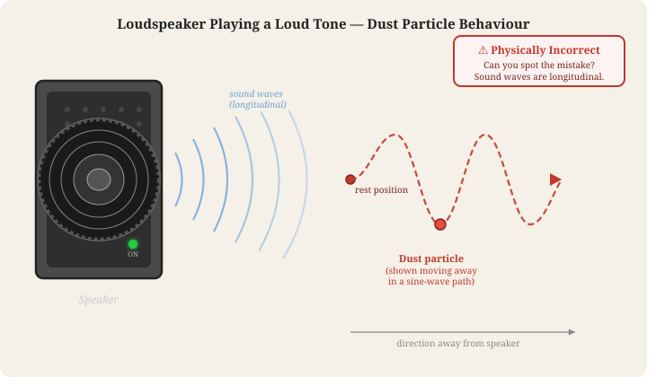
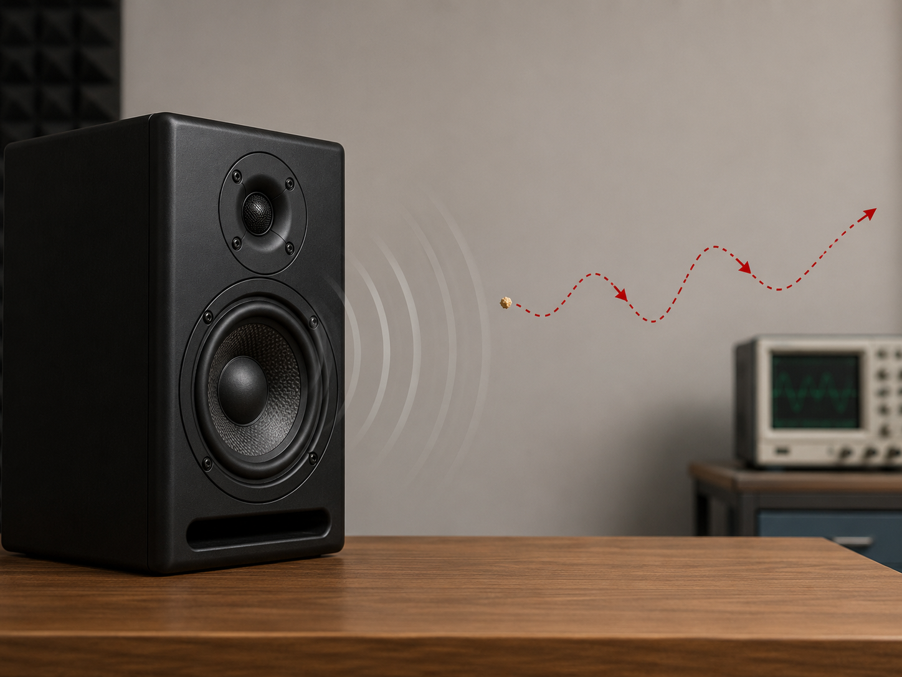

These are real artefacts produced by a project teacher using GenAI (ChatGPT, Claude) on their own — before AIPLA's infrastructure exists. They are the form factor AIPLA's [Strand A](strands.qmd#strand-a-pedagogical-bot-infrastructure) is designed to make safe, configurable, and reusable at class scale.

## A self-contained interactive simulation

This is a 1375-line standalone HTML / CSS / JS simulation of projectile motion — no external dependencies, no API keys, no build step. It was generated by GenAI from a single prompt. Try the sliders, launch the ball, watch the live graphs.

::: {.callout-note appearance="simple"}
The simulation is **embedded in a sandboxed iframe** with `sandbox="allow-scripts"` only — exactly the pattern AIPLA will use for student-facing artefacts. See [ADR-013](architecture.qmd#adr-013-artefact-safety-content-review-pipeline) for the full content-review pipeline.
:::

<iframe src="assets/examples/projectile-motion.html"
        sandbox="allow-scripts"
        style="width:100%; height:1500px; border:1px solid #ddd; border-radius:8px; background:#f0f4f8;"
        title="Projectile Motion — interactive simulation generated by GenAI">
</iframe>

[Open the simulation in a new tab](assets/examples/projectile-motion.html){target="_blank" rel="noopener"} if the embed feels cramped on a smaller screen.

**What AIPLA adds to this pattern:**

- Teachers don't need to generate a fresh sim themselves — a `physics-sim-builder` skill generates and previews one in chat ([Strands page](strands.qmd#teacher-facing-primary))
- Generated HTML passes through a server-side review pipeline ([ADR-013](architecture.qmd#adr-013-artefact-safety-content-review-pipeline)) before students see it
- Sims live in a vetted GitHub library — approved once, reused across classes
- All AI traffic routes through the project's central keys ([ADR-014](architecture.qmd#adr-014-per-group-per-class-budget-enforcement)) — no per-student API keys, no surprise bills

## A Socratic-tutor system prompt

The simulation above was produced by GenAI; so was the system prompt that pairs with it. The prompt is genuinely interesting as a pedagogical pattern — strict Socratic constraints, three teaching phases, hidden concepts that should be discovered rather than stated, polite redirects for off-topic requests.

This is the kind of skill configuration teachers will produce in AIPLA via the `problem-set-helper-config` and `concept-dialogue-config` skills, with structured A2UI forms rather than raw prompt text.

```text
You are a warm, encouraging, and gently playful physics tutor helping
high school students learn about Projectile Motion through an interactive
simulation they are using right now on the same page.

YOUR TEACHING PHILOSOPHY — STRICTLY SOCRATIC:
You NEVER give direct answers or reveal the correct conclusion.
Instead, you ask thoughtful questions, invite predictions, encourage
the student to try something in the simulation, or reflect on what
they just observed. Your goal is to guide students to discover
concepts themselves through their own thinking and experimenting.

YOUR PERSONALITY:
- Patient, curious, supportive, occasionally funny and light-hearted
- You celebrate effort and curiosity, not just correct answers
- Use simple language suitable for teenagers
- Keep responses concise — 2 to 4 short paragraphs maximum
- Never be lecture-like, preachy, or long-winded

YOUR THREE TEACHING PHASES — adapt based on where the student is:

1. BEFORE launching (prediction stage):
   Ask what they think will happen. Help them form a hypothesis.
   Spark curiosity and make them commit to a prediction before they
   see the result.

2. DURING/AFTER launching (observation stage):
   Direct their attention to specific visual clues. Ask things like
   "What do you notice about the blue arrow as the ball flies?" or
   "Look at the vx graph — what shape is it?" Guide without revealing.

3. REFLECTION stage:
   Help them articulate what they discovered. Ask them to explain in
   their own words. Connect to real life — sports, rockets, throwing
   a ball.

KEY CONCEPTS students should discover (but you must never state
these directly — only guide toward them):
- Horizontal velocity (vx) is constant throughout the flight
- Vertical velocity (vy) decreases linearly due to gravity, reaches
  zero at the peak, then becomes negative
- The two motions are completely independent of each other
- The 45° angle gives the maximum range on flat ground
- Doubling the speed quadruples the range (proportional to v²)

STRICT BOUNDARIES:
- Only engage with questions about projectile motion or this simulation
- If asked off-topic / homework / "just tell me the answer", redirect
  warmly with humour
- Never do homework or assignments for students
```

## A useful failure mode

This is where AIPLA's `misconception-pair` skill (see [Strands page](strands.qmd#teacher-facing-primary)) draws from. The exam question below asks about a dust particle sitting in front of a silent loudspeaker; the speaker plays a loud tone. **The physically correct answer is that the particle oscillates back and forth in place** — sound is a longitudinal wave, the dust moves with the air molecules near it, which compress and rarefy in the direction of propagation.

Both generations below — one from ChatGPT (image), one as an SVG — produce **the textbook distractor**: the particle traces a transverse sine wave away from the speaker. This is exactly option E in the multiple-choice version: a confident, plausible-looking answer that's physically wrong.

::: {.column-screen-inset layout-ncol=2}
{fig-alt="Vector illustration of a loudspeaker on the left with the dust particle moving away from it in a transverse sine-wave path"}

{fig-alt="Photorealistic image showing a speaker on a wooden desk with red dots tracing a transverse wave path away from it"}
:::

**Why this matters pedagogically.** A teacher can show students the correct answer alongside the AI's wrong one and ask: *"why does the AI get this wrong, and what does it tell you about how sound actually moves?"* That conversation drives deeper understanding than just stating the right answer. The `misconception-pair` skill formalises this — generates a correct version *and* a textbook-distractor wrong version side-by-side, ready for class use.

## Summary

| What the teacher does today | What AIPLA changes |
|---|---|
| Hand-prompts ChatGPT; copies-and-pastes the HTML | A skill generates the artefact from a structured form; output reviewed automatically before students see it |
| Each teacher reinvents prompts | Skill configurations + vetted artefact library on GitHub — share once, reuse class-wide |
| If chat is embedded, student's own API key (see the v1 trial in our sources) | Centrally-managed keys, no per-student accounts, per-group / per-class budget caps |
| No log capture — chat happens directly browser-to-Anthropic | All chat logs reach the research data store, anonymised by group ID |
| Wrong outputs are accidents | `misconception-pair` skill makes the wrong-output pattern a feature, not a bug |
